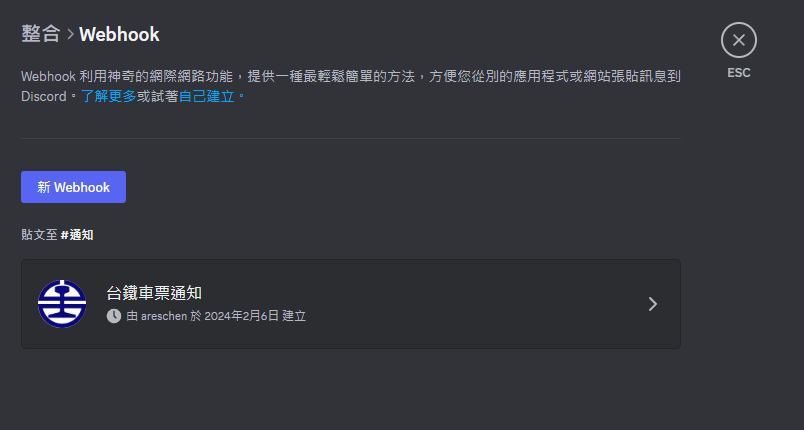

<br />
<div align="center">
  <a href="https://github.com/ares30841167/tr-ticket-watcher">
    
  </a>

  <h3 align="center">TR Ticket Watcher</h3>

  <p align="center">
    台鐵班次車票看門狗
  </p>
</div>

## 關於專案

這是一個可以不斷自動幫使用者檢查其所指定的班次列車空位情況，並在有空位時透過 Discord Webhook 傳送通知使用者的車票看門狗腳本。

## 使用說明

使用步驟如下，

1. 安裝專案所需的 python 相依套件

    ```python
    pip install -r requirements.txt
    ```

2. 使用者自行至想要接收通知的 Discord 頻道，產生 Webhook 網址 (對頻道按右鍵點選編輯頻道，進到整合頁面新增)。

    

3. 在專案根目錄下創建 .env 檔案，可參考 .env.example 進行設定，將上述複製的內容設置於 .env 內

    ```text
    DISCORD_WEBHOOK_URL={Discord Webhook URL}
    START_STA={Start Station，e.g 0980-南港}
    END_STA={End Station，e.g 7160-羅東}
    RIDE_DATE={Ride Date}
    QTY={Quantity}
    TRAIN_NO={Train Number}
    ```

4. 執行程式開始自動檢查

    ```python
    python main.py
    ```

## 致謝

- [Search icons created by Maxim Basinski Premium - Flaticon](https://www.flaticon.com/free-icons/search)